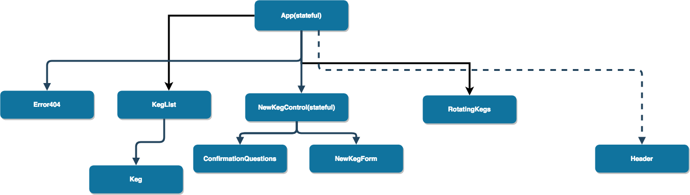

# TapRoom

This Project creates a taproom web app where users can display and add kegs they offer.
## Created By
Eliot Charette
September 2018

## Installation
1. Clone to your local computer from github.
2. First type "npm i" in your command line.
3. Then type "npm run start" in your command line.

## Specifications

1. Allow user to display current list of kegs.
2. Allow user to add more kegs to keg list.

## Future Additions

1.

| Component Flow Chart|
|-----------|
||
### Technologies Used

* JS
* HTML
* React
* CSS
* Bootstrap

### Support and Contact Details
If you encounter any bugs or would like to make suggestions regarding this project, please feel free to contact one of our engineers eliotcharette@gmail.com

### License

This project is distributed under the MIT License
