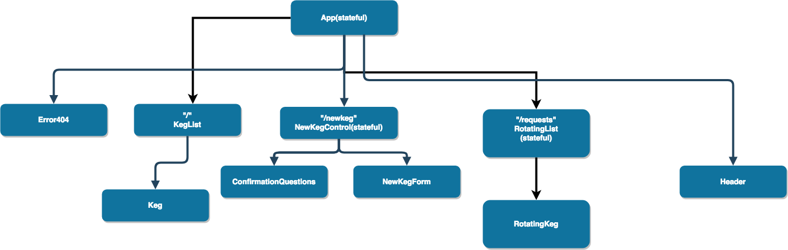

# TapRoom

This Project creates a taproom web app where users can display and add kegs they offer.
## Created By
Eliot Charette
September 2018

## Installation

1. git clone https://github.com/eliotcharette/Tap-room-react.git
2. cd Tap-room-react
3. npm install
4 npm run start

## Specifications

1. Allow user request new beers.
2. Allow user vote up or down requested beers.
3. Display feature beer list.

## Future Additions

1.Allow user to upload images in form for new beer requests.

| Component Flow Chart|
|-----------|
||
### Technologies Used

* JS
* HTML
* React
* CSS
* Bootstrap

### Support and Contact Details
If you encounter any bugs or would like to make suggestions regarding this project, please feel free to contact one of our engineers eliotcharette@gmail.com

### License

This project is distributed under the MIT License
